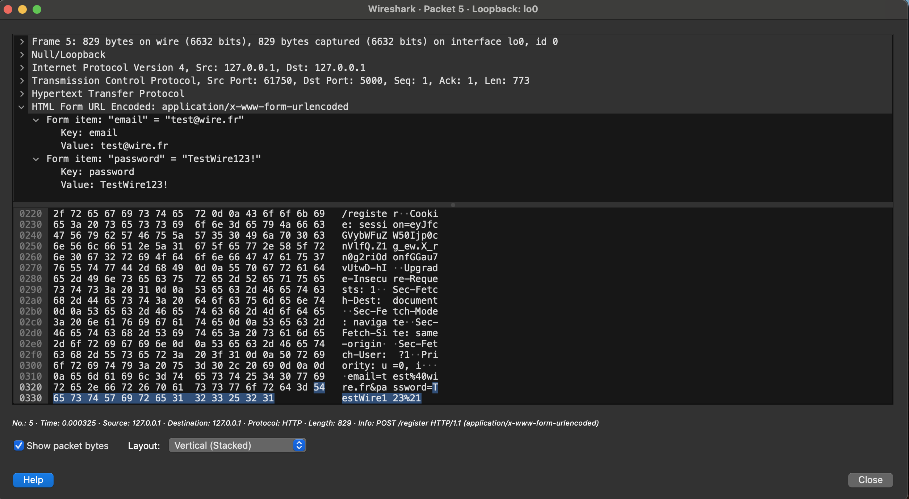

# ProjetCrypto

Gestionnaire de mots de passes

`python3 -m venv venv`
`source venv/bin/activate`

### Installer les dépendances

`pip install -r requirements.txt`

### BDD

Créer sa base mysql, puis à la racine du dossier créer un fichier .env qui aura la forme:

DB_HOST=

#

DB_USER=

#

DB_PASSWORD=

#

DB_NAME=

#

SECRET_KEY=

#

SECRET_KEY_flask=

#

où SECRET_KEY est la clé secret pour le hashage et le chiffrement (poivre)

#

SECRET_KEY_flask est la clé secrète de l'application flask

puis lancer le main à la racine:

`python3 main.py`

## HTTPS

Car sinon avec WireShark on peut capturer et les afficher en clair les mots de passes lors du transfert au serveur:


### Génère une clé privée

`openssl genrsa -out key.pem 2048`

### Génère une demande de signature de certificat (CSR)

`openssl req -new -key key.pem -out cert.csr`

#### Génère un certificat auto-signé

`openssl x509 -req -days 365 -in cert.csr -signkey key.pem -out cert.pem`

## Pour lancer le projet faire

`python app.py`

###

Pour la fonction `check_password_leak` on utilise l'api `https://haveibeenpwned.com/API/v2`, la fonction suit cet algorithme :

```
Searching by range
In order to protect the value of the source password being searched for, Pwned Passwords also implements a k-Anonymity model that allows a password to be searched for by partial hash. This allows the first 5 characters of a SHA-1 password hash (not case-sensitive) to be passed to the API (testable by clicking here):

GET https://api.pwnedpasswords.com/range/{first 5 hash chars}
When a password hash with the same first 5 characters is found in the Pwned Passwords repository, the API will respond with an HTTP 200 and include the suffix of every hash beginning with the specified prefix, followed by a count of how many times it appears in the data set. The API consumer can then search the results of the response for the presence of their source hash and if not found, the password does not exist in the data set. A sample response for the hash prefix "21BD1" would be as follows:
```
